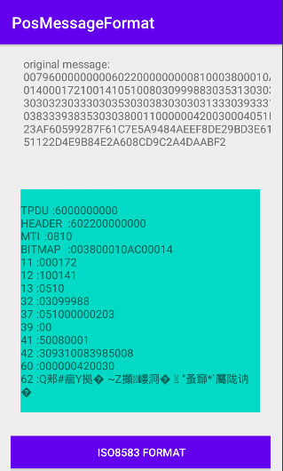

# PosMessageFormat
iso8583 message format for Android/Java

 

#### how to use:

Add it in your root build.gradle at the end of repositories:

	allprojects {
		repositories {
			...
			maven { url 'https://jitpack.io' }
		}
	}
Step 2. Add the dependency

	dependencies {
	        implementation 'com.github.CrazyDudo:PosMessageFormat:Tag'
	}

#### todo:

spdh

---

[Java8583](https://github.com/Ajsgn/Java8583 "Java8583")